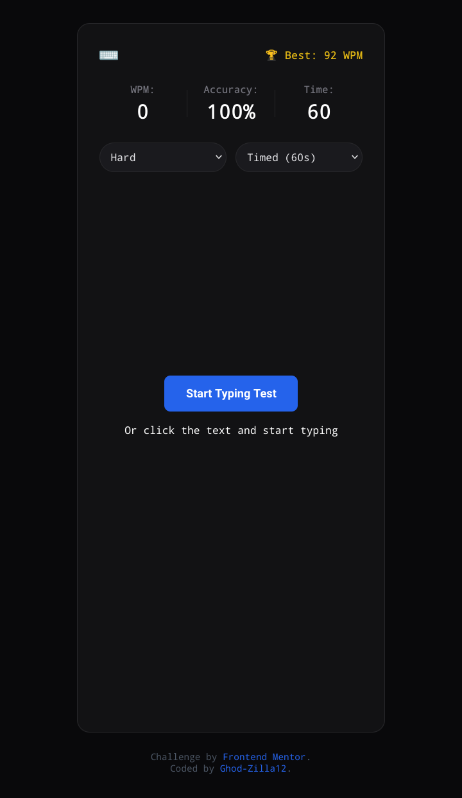

# Frontend Mentor - Typing Speed Test Solution

This is a solution to the [Typing Speed Test challenge on Frontend Mentor](https://www.frontendmentor.io/challenges/typing-speed-test-ygneS1470_). Frontend Mentor challenges help you improve your coding skills by building realistic projects. 

## Table of contents

- [Overview](#overview)
  - [The challenge](#the-challenge)
  - [Screenshot](#screenshot)
  - [Links](#links)
- [My process](#my-process)
  - [Built with](#built-with)
  - [What I learned](#what-I-learned)
  - [Continued development](#continued-development)
  - [Useful resources](#useful-resources)
- [Author](#author)
- [Acknowledgments](#acknowledgments)

## Overview

### The challenge

Users should be able to:

- View the optimal layout for the interface depending on their device's screen size.
- See hover and focus states for all interactive elements on the page.
- Select different typing difficulties (Easy, Medium, Hard) using a custom dropdown menu that dynamically updates the text passage via JSON data.
- Run a functional typing speed test with real-time calculated Words Per Minute (WPM), typing Accuracy, and a countdown clock timer.

### Screenshot



### Links

- Solution URL: [Add your solution URL here](https://github.com/Ghod-Zilla12/Typing-speed-test)
- Live Site URL: [Add your live site URL here](https://ghod-zilla12.github.io/Typing-speed-test/)

## My process

### Built with

- Semantic HTML5 markup
- CSS custom properties (Variables)
- Flexbox layouts
- Mobile-first design workflow
- Vanilla JavaScript (Asynchronous DOM operations & Event Streams)

### What I learned

During this project, I ran into a massive layout problem where my main container card would collapse completely to zero height when the inner passage text wasn't populated yet. I learned how to use structural layout rules like `min-height` alongside explicit relative wrappers to guarantee that our card component stays visually tall, structured, and elongated across both desktop and mobile layouts.

I also learned how to transition data targeting logic in JavaScript from hardcoded DOM buttons to responsive drop-down select controls. Instead of binding listeners to multiple distinct IDs, checking value properties across select options kept the codebase cleaner and stopped execution crashes:

```js
// Dynamically switching passages via drop-down choices without crashing
difficultySelect.addEventListener('change', (e) => {
  resetGame();
  passageWrapper.classList.add('locked');
  loadQuote(e.target.value);
});
```

On the CSS side, I achieved a frosted background aesthetic by separating the blurred content view cleanly from its absolute parent container to make sure standard font scales remain highly legible:

```CSS
.passage-wrapper.locked .passage-box {
  filter: blur(6px);
  opacity: 0.2;
  user-select: none;
  pointer-events: none;
}
```

### Continued development
    
  - Dynamic Data Scalability: I want to expand my data.json collection to include longer text sets and specialized coding syntax fragments to diversify typing content arrays.
  - Asynchronous Optimization: I plan on reinforcing file fetching checks to safeguard gracefully against external runtime or missing data errors.
 
### Useful resources

  - MDN Web Docs - KeyboardEvent - This helped me map input capture mechanisms precisely to accurately evaluate real-time mistakes made within character string checks.
  - CSS-Tricks - Guide to Flexbox - A great reference guide that helped me structure vertical alignment behaviors so that the header, body, and footer sections stack beautifully.

## Author

  - Website - Ghod-Zilla12
  - Frontend Mentor - Ghod-Zilla12
  - GitHub - ghod-zilla12

## Acknowledgments

Shout out to the Frontend Mentor community and peer code reviews that helped highlight layout constraints on mobile viewports, which ultimately led to shifting toward a cleaner and more modern UI design.
